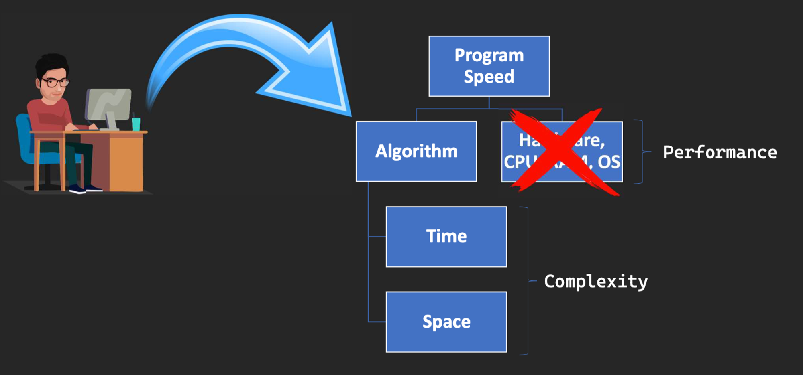
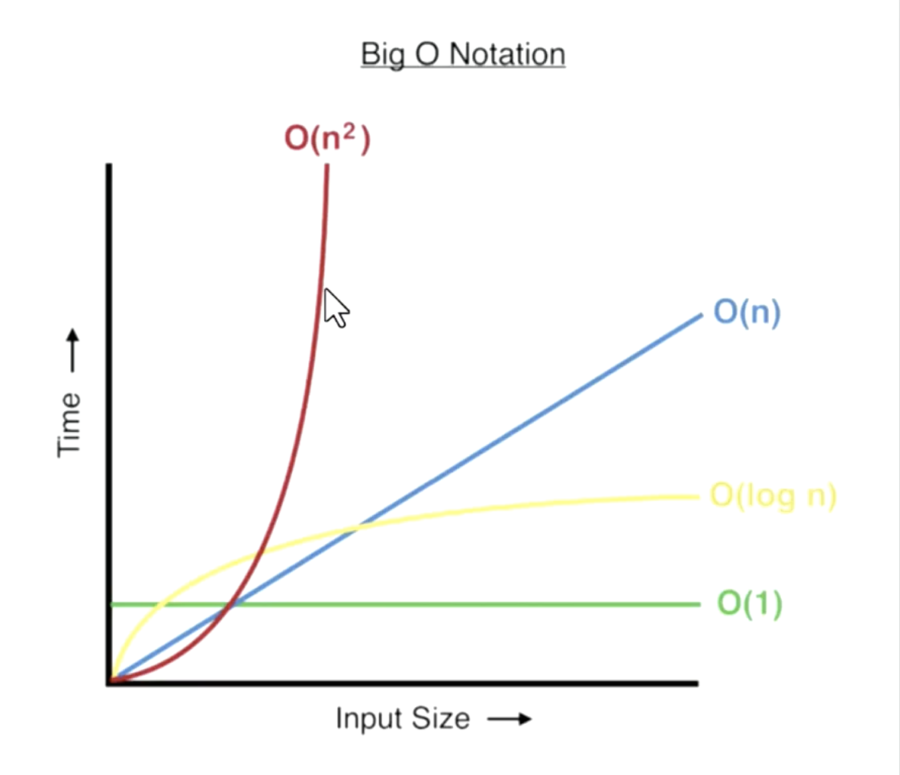
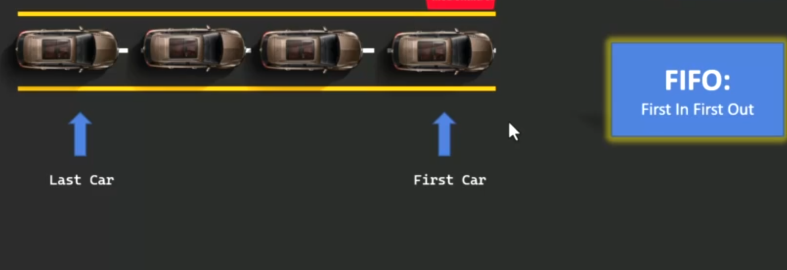

# Data Structure :

- **Wath is data structure ?**
    - A data structure is a specialized format for organizing, processing, retrieving and storing data. It provides a means to manage large amounts of data efficiently for uses such as large databases and internet indexing services.

<aside>
💡 **Differences between Data structure and Database ?**

>> Data structures : Data in RAM inside the program (temporary).

>> Database : Data In Hard Disk outside the program (Permenent).

</aside>

- **Classification of Data structure ?**
    - **Primitive (Basic) Data structure.**
        
        Primitive Data Structures are the basic structures that directly contain the data. They include simple data types like integers, floats, characters, and booleans.
        
    - **Non-Primitove (Advance) Data structrure.**
        
        Non-Primitive (Advanced) Data Structures are more complex data structures that are built from primitive data structures. They include arrays, lists, stacks, queues, trees, graphs, and others.
        

# Big O Notation  :

<aside>
🗣 **Big O notation is used to classify algorithms according to how their running time or space requirements grow as the input size grows.**

</aside>

<aside>
🗣 **Big O is not going to give you an exact answer on how long a piece of code will take to run.**

</aside>

- **`Things Affect Program Speed & Efficiency :`**
    
    
    
    - **Time complexity:**  specifies how long it will take to execute an algorithm as a function of its input size.
    - **Space complexity:**  specifies the total amount of space or memory required to execute an algorithm as a function of the size of the input.
    
- **Big O(1) :**  It means that the execution time or space used by an algorithm is constant and does not change with the size of the input data set.
- **Big O(n) :**  It means the performance of an algorithm is directly proportional to the size of the input data set. (like loop).
- **Big O(n^2) :** Examples of O(n^2) complexity algorithms include bubble sort and insertion sort.
- **Big O(log(n)) :**  This is typically seen in algorithms that break down the data into smaller chunks in each iteration, such as binary search.
- **Which is Faster ?**
    
    
    

## 👉 **Stack :**

> A stack is a linear data structure that follows the **Last-In-First-Out (LIFO)** principle. It behaves like a stack of plates, where the last plate added is the first one to be removed.
> 
> 
> 
> 
> > **Key Operations on Stack Data Structures :**
> > 
> > - **Push**: Adds an element to the top of the stack.
> > - **Peek**: Returns the top element without removing it.
> > - **Pop**: Removes the top element from the stack.

## 👉 **Vector :**

> Vector  is a type of dynamic array which has the ability to resize automatically after insertion or deletion of elements. The elements in vector are placed in contiguous storage so that they can be accessed and traversed using iterators. Element is inserted at the end of the vector
> 

## 👉 **Queue  :**

> **Queue**  is a fundamental concept in computer science used for storing and managing data in a specific order. It follows the principle of “**First in, First out**” **(FIFO)**, where the first element added to the queue is the first one to be removed. Queues are commonly used in various algorithms and applications for their simplicity and efficiency in managing data flow.
> 
> 
> 
> 
> > key operation  like stack.
> > 

## 👉 **Linked List :**

> A **linked list**  is a fundamental data structure in computer science. It consists of nodes where each node contains **data** and a **reference (link)** to the next node in the sequence. This allows for dynamic memory allocation and efficient **insertion** and **deletion** operations compared to arrays.
> 
> 
> 
> 
> Additionally, there are more types of linked lists available such as the doubly linked list and the circular linked list.
> 

## 👉 **Map :**

> **Map  :**  data structure (also known as a **dictionary** , **associative array** , or **hash map** ) is defined as a data structure that stores a collection of key-value pairs, where each key is associated with a single value.
> 
> 
> **Maps** provide an efficient way to store and retrieve data based on a unique identifier (the key).
> 
> ```cpp
> int main()
> {
>     // Create a map of strings to integers
>     map<string, int> mp;
>  
>     // Insert some values into the map
>     mp["one"] = 1;
>     mp["two"] = 2;
>     mp["three"] = 3;
>  
>     // Get an iterator pointing to the first element in the
>     map<string, int>::iterator it = mp.begin();
>  
>     // Iterate through the map and print the elements
>     while (it != mp.end()) {
>         cout << "Key: " << it->first
>              << ", Value: " << it->second << endl;
>         ++it;
>     }
>     return 0;
> }
> ```
>